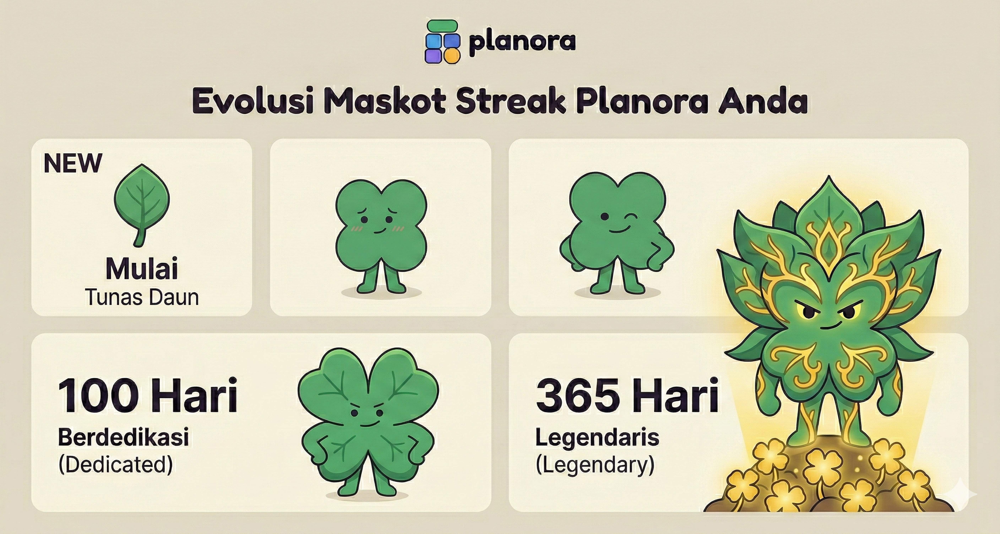

#  Planora

### Your Intelligent Academic Command Center

**Nama Website :** Planora  
**Nama Tim :** Tiga Serangkai  
**Dengan Backend :** Tidak menggunakan backend (Frontend-focused application)

---

## 📖 Tentang Planora

Mahasiswa sering menghadapi berbagai tantangan dalam mengatur kegiatan akademik mereka.  
Mulai dari tugas yang menumpuk, jadwal yang tidak terorganisir, hingga kesulitan menjaga konsistensi belajar.

**Planora hadir sebagai solusi all-in-one academic productivity platform** yang membantu mahasiswa mengatur tugas, jadwal, rencana belajar, dan fokus belajar dalam satu sistem yang terstruktur dan intuitif.

Dengan pendekatan **smart productivity**, Planora tidak hanya membantu pengguna merencanakan aktivitas, tetapi juga membangun kebiasaan belajar yang konsisten melalui sistem kolaborasi dan gamifikasi.

---

# 🚀 Fitur Utama

Planora menghadirkan lima fitur utama yang dirancang untuk mendukung produktivitas akademik secara menyeluruh.

## 📅 Scheduler (Penjadwalan)

Kalender interaktif yang memungkinkan pengguna merencanakan berbagai aktivitas akademik seperti:

- Jadwal kuliah
- Tenggat waktu tugas
- Pertemuan kelompok
- Proyek akademik

Dengan tampilan visual yang jelas, pengguna dapat memantau agenda mereka secara lebih terstruktur dan efisien.

---

## ✅ Tasks (Manajemen Tugas)

Fitur pengelolaan tugas yang membantu pengguna:

- Membuat daftar tugas
- Menentukan prioritas
- Mengatur deadline
- Melacak progres penyelesaian

Dengan sistem ini, pengguna dapat mengelola beban tugas mereka secara lebih terorganisir.

---

## 📚 Learning Plan (Rencana Belajar Terstruktur)

Fitur ini membantu pengguna menyusun strategi belajar secara sistematis.

Pengguna dapat membuat sesi belajar yang mencakup:

- Membaca materi PDF
- Menonton video pembelajaran
- Mengerjakan latihan soal atau kuis

Dengan Learning Plan, proses belajar menjadi lebih terarah dan efektif.

---

## 📂 Materials (Penyimpanan Materi)

Planora menyediakan sistem penyimpanan materi belajar yang terpusat.

Pengguna dapat:

- Membuat folder materi
- Mengunggah sumber belajar
- Mengelola referensi akademik

Fitur ini membantu pengguna menjaga seluruh materi pembelajaran tetap terorganisir dan mudah diakses.

---

## ⏱ Timer (Fokus & Produktivitas)

Planora dilengkapi dengan **timer belajar** yang mendukung teknik manajemen fokus seperti:

- **Pomodoro Technique**
- **Deep Work Session**

Selain itu, tersedia pilihan **ambience sound** untuk membantu menciptakan lingkungan belajar yang lebih kondusif dan meningkatkan konsentrasi pengguna.

---

# 🌟 Keunggulan Planora

Planora tidak hanya berfungsi sebagai alat perencanaan akademik, tetapi juga menghadirkan pengalaman belajar yang lebih interaktif melalui kolaborasi dan gamifikasi.

---

## 🤝 Collaborator (Kolaborasi Belajar)

Planora memungkinkan pengguna untuk belajar bersama melalui fitur **Collaborator**.

Pada fitur **Scheduler** dan **Learning Plan**, pengguna dapat:

- Mengundang teman menggunakan **Join Code**
- Merencanakan jadwal belajar bersama
- Mengelola proyek akademik secara kolaboratif

Dengan fitur ini, proses belajar menjadi lebih interaktif dan produktif.

---

## 🔥 Streak System (Gamifikasi Produktivitas)

  

Untuk meningkatkan konsistensi belajar, Planora menghadirkan sistem **Streak** yang memotivasi pengguna untuk tetap disiplin.

Jenis streak yang tersedia:

- **Streak Individu**  
  Memantau konsistensi aktivitas belajar pengguna secara personal.

- **Streak Kelompok**  
  Tersedia pada fitur **Scheduler** untuk memonitor konsistensi kolaborasi dalam proyek tim.

- **Streak Antar Teman**  
  Terdapat pada fitur **Learning Plan**, yang mendorong interaksi dan motivasi belajar antar pengguna.

---

# 🎯 Visi Planora

Planora bertujuan menjadi **platform produktivitas akademik yang membantu mahasiswa mengelola waktu, tugas, dan proses belajar secara lebih cerdas, terstruktur, dan kolaboratif.**

Dengan pendekatan yang menggabungkan **perencanaan, fokus, kolaborasi, dan motivasi**, Planora membantu pengguna membangun kebiasaan belajar yang konsisten dan berkelanjutan.

---

# 💡 Teknologi

Planora dikembangkan sebagai **frontend-focused web application** dengan pendekatan desain modern dan responsif.

Fokus utama pengembangan adalah pada:

- User Experience (UX)
- Interface Design (UI)
- Interaktivitas pengguna

Aplikasi ini dirancang untuk memberikan pengalaman penggunaan yang **clean, intuitif, dan efisien** bagi mahasiswa.

---

✨ **Planora — Plan Smarter, Achieve Better.**